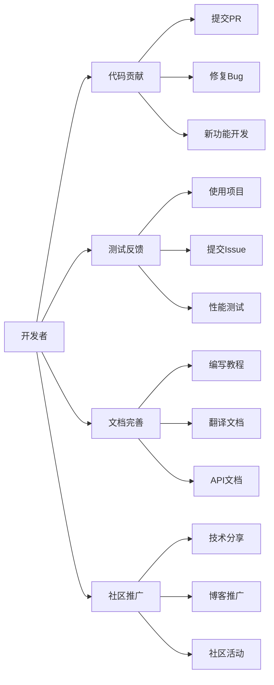

# 🚀 AIDotNet - 连接智能与未来

**汇聚AI与.NET技术的开源创新力量**

*构建智能、高效且易用的AI解决方案*

[🌟 核心项目](#-核心项目) • [👥 团队成员](#-核心团队) • [🤝 加入我们](#-加入我们) • [📞 联系方式](#-联系我们)

---

## 💡 我们的使命

AIDotNet 是由一群热爱AI和.NET技术的开发者组成的开源社区。我们致力于：

- 🎯 **推动AI技术普及化** - 让AI技术更容易被开发者采用和集成
- 🔧 **构建实用工具链** - 开发高质量、易用的AI开发工具和框架
- 🌐 **促进开源协作** - 大部分项目采用 Apache License 2.0，支持自由使用和商业化
- 📚 **知识分享传播** - 通过文档、教程和社区交流推广最佳实践

## 🌟 核心项目

> 💫 **明星项目** - 获得社区广泛认可的核心产品

### 🏆 重点推荐

| 项目 | Stars | 技术栈 | 特色功能 |
|------|-------|--------|----------|
Aspire可观测性 🧠 全功能AI知识库/智能体 |
| [**OpenDeepWiki**](https://github.com/AIDotNet/OpenDeepWiki) |  | C# + TypeScript | 📚 企业级知识管理平台 🔧 模块化设计，易扩展 🎨 现代化UI界面 |
| [**AntSK**](https://github.com/AIDotNet/AntSK) |  | .NET 9 + AntBlazor + Semantic Kernel | 🔥 本地离线AI大模型支持 📊 集成
| [**koala-ai**](https://github.com/AIDotNet/koala-ai) |  | .NET 8 + React | 🤖 企业级智能客服 💬 知识库问答系统 ⚡ 高性能响应 |

### 🛠️ 专业工具

| 项目 | Stars | 描述 |
|------|-------|------|
| [**auto-prompt**](https://github.com/AIDotNet/auto-prompt) |  | 🎯 AI提示词优化平台，提升AI交互效果 |
| [**Thor**](https://github.com/AIDotNet/Thor) |  | 🔌 统一AI模型接口中间件，兼容OpenAI格式 |
| [**AutoGpt**](https://github.com/AIDotNet/AutoGpt) |  | 🧠 智能推理SDK，多轮对话增强AI能力 |

### 📦 开发组件

- **GraphRag.Net** - 基于Semantic Kernel的检索增强生成实现
- **ThorChat** - 基于LobeChat的静态前端聊天应用
- **SemanticKernel.Samples** - Semantic Kernel最佳实践示例

## 👥 核心团队

<table>
  <tr>
  <td align="center" width="150">
  <a href="https://github.com/239573049">
  
   <b>Token</b>
  </a>
   Microsoft MVP
   技术探索者
  </td>
  <td align="center" width="150">
  <a href="https://github.com/xuzeyu91">
  
   <b>xuzeyu91</b>
  </a>
   Microsoft AI Platform MVP
   华为云开发者专家
  </td>
  <td align="center" width="150">
  <a href="https://github.com/whuanle">
  
   <b>whuanle</b>
  </a>
   技术博主
   微服务架构专家
  </td>
  <td align="center" width="150">
  <a href="https://github.com/anjoy8">
  
   <b>张安忠</b>
  </a>
   连续五年 Microsoft MVP
   .NET 技术布道者
  </td>
  </tr>
</table>

查看更多团队成员 👥

| 成员 | 专业领域 | 贡献亮点 |
|------|----------|----------|
| [**MrChuJiu**](https://github.com/MrChuJiu) | .NET + Angular | Microsoft MVP，全栈开发专家 |
| [**longdream**](https://github.com/longdream) | 技术架构 | 技术梦想家，创新推动者 |
| [**snake-L**](https://github.com/snake-L) | 开源贡献 | 活跃的技术贡献者 |

## 🚀 加入我们

### 🌈 多种参与方式，总有一款适合你

### 🎯 贡献指南

| 贡献类型 | 适合人群 | 如何开始 |
|----------|----------|----------|
| 🔧 **代码贡献** | 有一定开发经验 | Fork项目 → 开发功能 → 提交PR |
| 🧪 **测试反馈** | 产品使用者 | 使用项目 → 发现问题 → 提交Issue |
| 📝 **文档完善** | 技术写作爱好者 | 改进文档 → 编写教程 → 提交PR |
| 📢 **社区推广** | 技术布道者 | 技术分享 → 博客推广 → 参与活动 |

## 📊 项目统计

## 🔗 联系我们

### 🌍 社区资源

- 📚 [技术文档](https://docs.token-ai.cn) - 详细的使用指南和API文档
- 🎥 [视频教程](https://space.bilibili.com/xxx) - B站技术分享视频
- 💬 [QQ交流群](https://qm.qq.com/xxx) - 即时技术交流
- 🐧 [微信群](https://weixin.qq.com/xxx) - 扫码加入开发者群

---

**🎉 感谢每一位贡献者的付出！**

一起构建AI与.NET的美好未来 🚀

