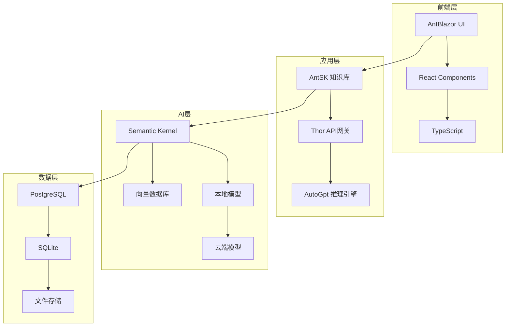
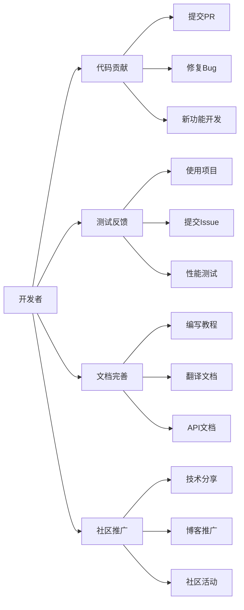

# 🚀 AIDotNet - 连接智能与未来

**汇聚AI与.NET技术的开源创新力量**

*构建智能、高效且易用的AI解决方案*

[🌟 核心项目](#-核心项目) • [👥 团队成员](#-核心团队) • [🤝 加入我们](#-加入我们) • [📞 联系方式](#-联系我们)

---

## 💡 我们的使命

AIDotNet 是一群热爱DotNet的开源爱好者组成，为了让DotNet赋能AI，让AI轻松带入您的产品，我们成立了AIDotNet组织。我们致力于：

- 🎯 **推动AI技术普及化** - 让AI技术更容易被开发者采用和集成
- 🔧 **构建实用工具链** - 开发高质量、易用的AI开发工具和框架  
- 🌐 **促进开源协作** - 大部分项目采用 Apache License 2.0 和 MIT License，支持自由使用和商业化
- 📚 **知识分享传播** - 通过文档、教程和社区交流推广最佳实践

## 🌟 核心项目

> 💫 **明星项目** - 获得社区广泛认可的核心产品

### 🏆 重点推荐

| 项目 | Stars | 技术栈 | 特色功能 |
|------|-------|--------|----------|
| [**OpenDeepWiki**](https://github.com/AIDotNet/OpenDeepWiki) |  | .NET 9 + TypeScript + Semantic Kernel | 📚 开源知识管理平台 🔧 模块化设计，易扩展 🎨 现代化UI界面 |
| [**AntSK**](https://github.com/AIDotNet/AntSK) |  | .NET 8 + AntBlazor + Semantic Kernel | 🔥 本地离线AI大模型支持 📊 集成Aspire可观测性 🧠 全功能AI知识库/智能体 |
| [**Thor**](https://github.com/AIDotNet/Thor) |  | .NET 8 + OpenAI Compatible | 🔌 统一AI模型接口中间件 ⚡ 兼容OpenAI格式 🔑 内置用户权限管理 |
| [**auto-prompt**](https://github.com/AIDotNet/auto-prompt) |  | .NET + React | 🎯 AI提示词优化平台 🧠 智能优化算法 📊 可视化调试工具 |

### 🛠️ 专业工具

| 项目 | 描述 | 技术栈 |
|------|------|--------|
| [**koala-ai**](https://github.com/AIDotNet/koala-ai) | 🤖 企业级智能客服系统，支持知识库问答 | .NET 8 + React |
| [**Text2Sql.Net**](https://github.com/AIDotNet/Text2Sql.Net) | 📝 自然语言转SQL工具 | .NET + Semantic Kernel |
| [**GraphRag.Net**](https://github.com/AIDotNet/GraphRag.Net) | 🕸️ 基于Semantic Kernel的检索增强生成 | .NET + Semantic Kernel |

### 📦 开发组件

- **SemanticKernel.Samples** - Semantic Kernel最佳实践示例
- **NuGet.Next** - 现代化的NuGet包管理平台

## 🏗️ 技术架构

## 👥 核心团队

<table>
  <tr>
  <td align="center" width="150">
  <a href="https://github.com/239573049">
  
   <b>Token</b>
  </a>
   Microsoft MVP
   技术探索者
  </td>
  <td align="center" width="150">
  <a href="https://github.com/xuzeyu91">
  
   <b>xuzeyu91</b>
  </a>
   Microsoft AI Platform MVP
   华为云开发者专家
  </td>
  <td align="center" width="150">
  <a href="https://github.com/whuanle">
  
   <b>whuanle</b>
  </a>
   技术博主
   微服务架构专家
  </td>
  <td align="center" width="150">
  <a href="https://github.com/anjoy8">
  
   <b>张安忠</b>
  </a>
   连续五年 Microsoft MVP
   .NET 技术布道者
  </td>
  </tr>
</table>

查看更多团队成员 👥

| 成员 | 专业领域 | 贡献亮点 |
|------|----------|----------|
| [**MrChuJiu**](https://github.com/MrChuJiu) | .NET + Angular | Microsoft MVP，全栈开发专家 |
| [**longdream**](https://github.com/longdream) | 技术架构 | 技术梦想家，创新推动者 |
| [**snake-L**](https://github.com/snake-L) | 开源贡献 | 活跃的技术贡献者 |

## 🤝 加入我们

### 🌈 多种参与方式，总有一款适合你

### 🎯 贡献指南

| 贡献类型 | 适合人群 | 如何开始 |
|----------|----------|----------|
| 🔧 **代码贡献** | 有一定开发经验 | Fork项目 → 开发功能 → 提交PR |
| 🧪 **测试反馈** | 产品使用者 | 使用项目 → 发现问题 → 提交Issue |
| 📝 **文档完善** | 技术写作爱好者 | 改进文档 → 编写教程 → 提交PR |
| 📢 **社区推广** | 技术布道者 | 技术分享 → 博客推广 → 参与活动 |

### 🔄 开发流程

1. **规划阶段** - 在GitHub Discussions中讨论新功能
2. **开发阶段** - Fork代码库，创建feature分支
3. **测试阶段** - 编写单元测试，确保代码质量
4. **审查阶段** - 提交PR，团队成员code review
5. **发布阶段** - 合并代码，更新文档，发布版本

## 📊 项目统计

**组织统计**
- 🌟 总Star数: 2000+
- 🍴 总Fork数: 500+
- 👥 活跃贡献者: 50+
- 📦 项目数量: 15+

## 🔗 联系我们

### 🌍 社区资源

- 🎥 [视频教程](https://space.bilibili.com/242357983) - B站技术分享视频
- 💬 [GitHub讨论](https://github.com/orgs/AIDotNet/discussions) - 技术问题交流
- 📧 [邮箱联系](mailto:239573049@qq.com) - 商务合作与技术支持

### 📱 社交媒体

- 🐧 **微信群** - 添加微信 `xuzeyu91` 并发送"进群"
- 📱 **QQ交流群** - 即时技术交流
- 🎯 **技术博客** - 定期发布技术文章和最佳实践

---

**🎉 感谢每一位贡献者的付出！**

一起构建AI与.NET的美好未来 🚀

**Made with ❤️ by AIDotNet Community**

