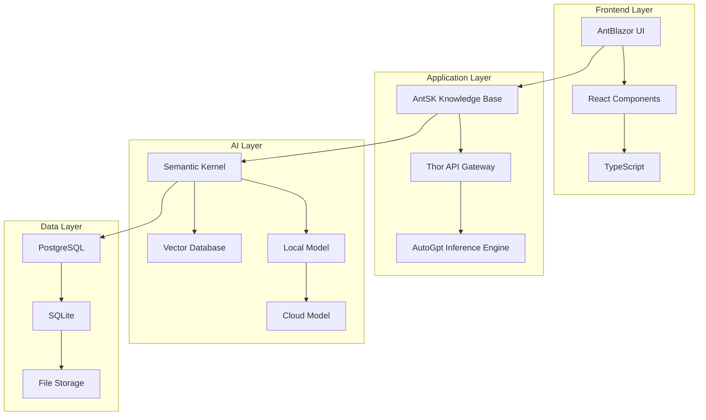
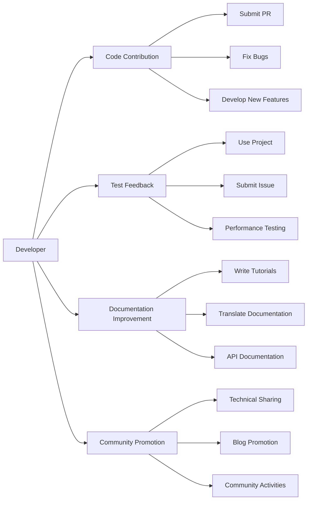

# 🚀 AIDotNet - Bridging Intelligence and the Future

**An Open Source Powerhouse Uniting AI and .NET Technologies**

*Building intelligent, efficient, and user-friendly AI solutions*

[🌟 Core Projects](#-core-projects) • [👥 Team Members](#-core-team) • [🤝 Join Us](#-join-us) • [📞 Contact](#-contact-us)

---

## 💡 Our Mission

AIDotNet is a group of open-source enthusiasts passionate about DotNet. We established AIDotNet to enable DotNet to empower AI and seamlessly integrate AI into your products. Our commitments include:

- 🎯 **Promoting AI Technology Adoption** - Making AI technologies easier for developers to adopt and integrate
- 🔧 **Building Practical Toolchains** - Developing high-quality, user-friendly AI development tools and frameworks
- 🌐 **Encouraging Open Source Collaboration** - Most projects use Apache License 2.0 and MIT License, supporting free use and commercialization
- 📚 **Knowledge Sharing and Dissemination** - Promoting best practices through documentation, tutorials, and community engagement

## 🌟 Core Projects

> 💫 **Featured Projects** - Core products widely recognized by the community

### 🏆 Highlighted Recommendations

| Project | Stars | Tech Stack | Key Features |
|---------|-------|------------|--------------|
| [**OpenDeepWiki**](https://github.com/AIDotNet/OpenDeepWiki) |  | .NET 9 + TypeScript + Semantic Kernel | 📚 Open-source knowledge management platform 🔧 Modular design, easy to extend 🎨 Modern UI interface |
| [**AntSK**](https://github.com/AIDotNet/AntSK) |  | .NET 8 + AntBlazor + Semantic Kernel | 🔥 Local offline AI large model support 📊 Integrated Aspire observability 🧠 Full-featured AI knowledge base/agent |
| [**Thor**](https://github.com/AIDotNet/Thor) |  | .NET 8 + OpenAI Compatible | 🔌 Unified AI model interface middleware ⚡ Compatible with OpenAI format 🔑 Built-in user permission management |
| [**auto-prompt**](https://github.com/AIDotNet/auto-prompt) |  | .NET + React | 🎯 AI prompt optimization platform 🧠 Intelligent optimization algorithms 📊 Visual debugging tools |

### 🛠️ Professional Tools

| Project | Description | Tech Stack |
|---------|-------------|------------|
| [**koala-ai**](https://github.com/AIDotNet/koala-ai) | 🤖 Enterprise-level intelligent customer service system, supporting knowledge base Q&A | .NET 8 + React |
| [**Text2Sql.Net**](https://github.com/AIDotNet/Text2Sql.Net) | 📝 Natural language to SQL tool | .NET + Semantic Kernel |
| [**GraphRag.Net**](https://github.com/AIDotNet/GraphRag.Net) | 🕸️ Retrieval-augmented generation based on Semantic Kernel | .NET + Semantic Kernel |

### 📦 Development Components

- **SemanticKernel.Samples** - Best practice examples of Semantic Kernel
- **NuGet.Next** - Modern NuGet package management platform

## 🏗️ Technical Architecture

## 👥 Core Team

<table>
  <tr>
  <td align="center" width="150">
  <a href="https://github.com/239573049">
  
   <b>Token</b>
  </a>
   Microsoft MVP
   Technology Explorer
  </td>
  <td align="center" width="150">
  <a href="https://github.com/xuzeyu91">
  
   <b>xuzeyu91</b>
  </a>
   Microsoft AI Platform MVP
   Huawei Cloud Developer Expert
  </td>
  <td align="center" width="150">
  <a href="https://github.com/whuanle">
  
   <b>whuanle</b>
  </a>
   Technical Blogger
   Microservices Architecture Expert
  </td>
  <td align="center" width="150">
  <a href="https://github.com/anjoy8">
  
   <b>Zhang Anzhong</b>
  </a>
   Five-time Microsoft MVP
   .NET Technology Evangelist
  </td>
  </tr>
</table>

See More Team Members 👥

| Member | Expertise | Contribution Highlights |
|--------|-----------|-------------------------|
| [**MrChuJiu**](https://github.com/MrChuJiu) | .NET + Angular | Microsoft MVP, Full-stack Development Expert |
| [**longdream**](https://github.com/longdream) | Technical Architecture | Technology Dreamer, Innovation Promoter |
| [**snake-L**](https://github.com/snake-L) | Open Source Contribution | Active Technical Contributor |

## 🤝 Join Us

### 🌈 Diverse Ways to Participate, There's One for You

### 🎯 Contribution Guidelines

| Contribution Type | Suitable For | How to Start |
|-------------------|--------------|--------------|
| 🔧 **Code Contribution** | Some development experience | Fork project → Develop features → Submit PR |
| 🧪 **Test Feedback** | Product users | Use project → Identify issues → Submit Issue |
| 📝 **Documentation Improvement** | Technical writing enthusiasts | Improve documentation → Write tutorials → Submit PR |
| 📢 **Community Promotion** | Technology evangelists | Technical sharing → Blog promotion → Participate in activities |

### 🔄 Development Process

1. **Planning Phase** - Discuss new features in GitHub Discussions
2. **Development Phase** - Fork the repository, create a feature branch
3. **Testing Phase** - Write unit tests to ensure code quality
4. **Review Phase** - Submit PR, team members conduct code review
5. **Release Phase** - Merge code, update documentation, release version

## 📊 Project Statistics

**Organization Statistics**
- 🌟 Total Stars: 2000+
- 🍴 Total Forks: 500+
- 👥 Active Contributors: 50+
- 📦 Number of Projects: 15+

## 🔗 Contact Us

### 🌍 Community Resources

- 🎥 [Video Tutorials](https://space.bilibili.com/242357983) - Technical sharing videos on Bilibili
- 💬 [GitHub Discussions](https://github.com/orgs/AIDotNet/discussions) - Technical question exchange
- 📧 [Email Contact](mailto:239573049@qq.com) - Business cooperation and technical support

### 📱 Social Media

- 🐧 **WeChat Group** - Add WeChat `xuzeyu91` and send "Join Group"
- 📱 **QQ Group Chat** - Instant technical exchange
- 🎯 **Technical Blog** - Regularly publish technical articles and best practices

---

**🎉 Thanks to every contributor for your efforts!**

Building a bright future for AI and .NET together 🚀

**Made with ❤️ by AIDotNet Community**

